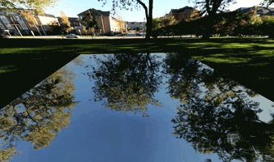

# wave-simulator
A graphical 3D simulation of the wave and heat equations.

## Overview
- Simply uses Euler's method for solving the wave equation for 2 spatial dimensions at a high FPS:
  - The two partial derivatives are approximated for each grid point by the positions of its neighbors
  - From this the sum of partial derivatives (Laplacian) is calculated and used as the point acceleration.
- The positions of each point are used to create and animate a polygon in Three.js
- For realistic rendering, a cubemap is used

## Controls
Make sure the 3D view is selected (clicked on), then use these keys:

|Key          |Action           |
|---          |---              |
|Mouse drag   | Orbit the scene |
|Up/down      |Zoom in/out      |
|Space  |Pause/play   |
|A   |Create droplet randomly   |
|S   |Tilt (gets rid of waves)   |

## Initial parameters
- f_0(x) is initial height function
- "0 at boundary/stable" specifies that where the function is stable or at the boundaries, the initial function should be overruled to have value 0.
- f'_0(x) is the initial velocity at each point, which is ignored by the heat equation.
- s: (x,y)->stable? is a binary function that specifies points that must be held stable (not including the simulation boundaries, which can be held stable with a following option).
- "Set initial from above definitions" resets the simulation to the initial conditions above. This updates your changes to the setup.

## Realtime parameters
You can adjust these as the simulation is running:
- At the top, you can switch between/realistic normal mode, as well as switch between which equation is being used. "Blend" lerps the velocities together using the factor following the button.
- Stable boundary indicates whether the rectangular boundary of the simulation should be held still.
- Finally, you can adjust the period and heat factor, which control how quickly each of the simulations is done. Be careful with your ranges of these as the simulation can become unstable.

## Specifying Equations
- Multiplication must be done explicitly with '*' (as in x*y NOT xy).
- Any javascript expression is a valid equation (don't embed this on websites with sensitive data).
- Special symbols are: sin, cos, tan, asin, acos, atan, sqrt, abs, exp, pow, max, min, pi, and, or, xor, not.
- The stable function should return true (1) or false (0) for each position.
